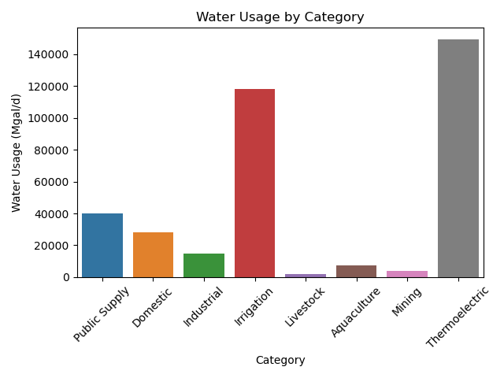
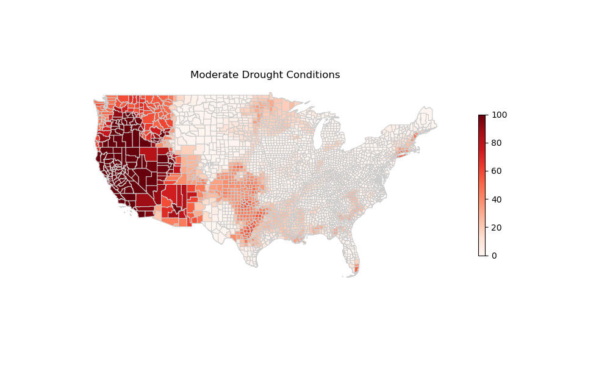
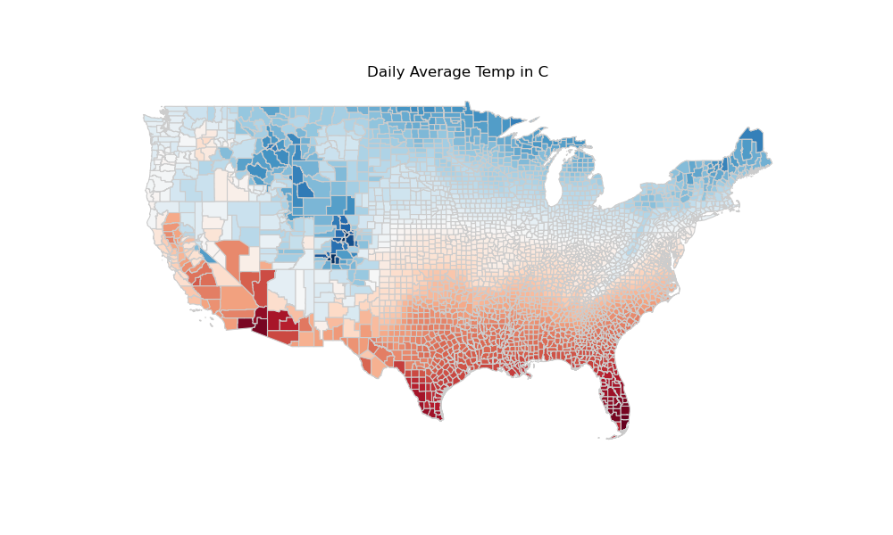
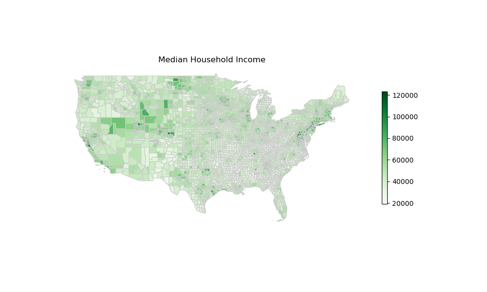

# Promoting Sustainable Water Practices: Clustering Across Counties and States
---

# Problem Statement
Climate change has emerged as a pressing global challenge, with significant implications for water resources. As temperatures rise and climates become increasingly erratic and unpredictable, the task of monitoring and managing water usage grows more complex. By leveraging machine learning, we can unlock valuable insights in relation to water consumption patterns that empower policymakers, water resource managers, and communities to make informed decisions, develop adaptation strategies, and implement proactive measures to sustainably manage our water resources in the face of an uncertain climate future.

The objective of this project is to use machine learning to build a clustering model to better understand, and be able to compare and contrast, state-county level water supply and consumption. By providing locally-relevant information, consumers of this information might better understand their own water consumption, identifying areas for improvement and efficiency, and industries in their local area may adjust consumption patterns through awareness and advocacy.

# Data Dictionary and Data Preparation

### Geographical Data

#### Input Data:
* Data Source: [National Weather Service](https://www.weather.gov/gis/Counties) (NWS). Counties of the U.S used by NWS to issue county based forecasts and warnings.

<<<<<<< HEAD
#### Data Preparation Steps
1. Columns present in other data frames were dropped: state and county name.
2. Irrelevant columns were dropped: cwa, time zone, and fe area.

*** Model Usage Data Dictionary***
=======
>>>>>>> a2fc01544ac868469694b4c269b7372cff1f79de
|Feature|Type|Description|
|---|-----|----------------------------------------------------|
|lon|float|Longitude; Angular distance of the county west of the meridian.|
|lat|float|Latitude; Angular distance of the county north of the equator.|

<<<<<<< HEAD
=======
#### Data Preparation Steps:
1. Columns present in other data frames were dropped: state and county name.
2. Irrelevant columns were dropped: cwa, time zone, and fe area.
>>>>>>> a2fc01544ac868469694b4c269b7372cff1f79de

---
### Estimated Water Usage Data

#### Input Data:
* Data Source: [United States Geological Survey Maryland, Delaware, and the District of Columbia Water Science Center - Public Data Releases](https://www.sciencebase.gov/catalog/item/get/5af3311be4b0da30c1b245d8/application/vnd.openxmlformats-officedocument.spreadsheetml.sheet).

* [Data Dictionary: sciencebase.gov](https://www.sciencebase.gov/catalog/item/get/5af3311be4b0da30c1b245d8/application/fgdc+xml)

* Citation: Dieter, C.A., Linsey, K.S., Caldwell, R.R., Harris, M.A., Ivahnenko, T.I., Lovelace, J.K., Maupin, M.A., and Barber, N.L., 2018, Estimated Use of Water in the United States County-Level Data for 2015 (ver. 2.0, June 2018): U.S. Geological Survey data release, https://doi.org/10.5066/F7TB15V5.

#### Data Preparation Steps:
1. The following columns were removed: unnamed: 0, year, state, and county name.
2. FIPS code column names were standardized to just 'fips'.  
3. All values of '--', were changed to 0, as this was likely the case if the information was not received from the county.  
4. For any value that was based on days or supply (e.g., number of days or gallons per day), NaN values were adjusted to 0. It is likely these values were 0 if they were not given by the counties.  
5. Averages were used in place of NaN for values that were population or temperature based.  

|Feature|Type|Description|
|---------------|------|------------------------------------------------------------------------------------------|
|state          |object|US postal abbreviation for one of the 48 contiguous states or the District of Columbia.| 
|countyname     |object|Name of the county.| 
|fips           |int   |Concatenation of the State Federal Information Processing Standards (FIPS) and County FIPS.| 
|tp_totpop      |float |Total population of the county, in thousands.|
|ps_gwpop       |float |Public Supply, population served by ground water, in thousands.|
|ps_swpop       |float |Public Supply, population served by surface water, in thousands.|
|ps_topop       |float |Public Supply, total population served, in thousands.|
|ps_wgwto       |float |Public Supply, groundwater withdrawals, total, in millions of gallons per day (Mgal/d).|
|ps_wswto       |float |Public Supply, surface-water withdrawals, total, in Mgal/d.|
|ps_wtotl       |float |Public Supply, total withdrawals, total (fresh+saline), in Mgal/d.|
|do_sspop       |float |Domestic, self-supplied population, in thousands.|
|do_sspcp       |float |Domestic, self-supplied per capita use, in gallons per day (gal/d).|
|do_psdel       |float |Domestic, deliveries from Public Supply, in Mgal/d.|
|do_pspcp       |float |Domestic, publicly supplied per capita use, in gal/d.|
|do_wfrto       |float |Domestic, total self-supplied withdrawals, fresh, in Mgal/d.|
|do_wdelv_      |float |Domestic, total use (withdrawals + deliveries), in Mgal/d.|
|in_wgwto       |float |Industrial, self-supplied groundwater withdrawals, total, in Mgal/d.|
|in_wswto       |float |Industrial, self-supplied surface-water withdrawals, total, in Mgal/d.|
|in_wtotl       |float |Industrial, self-supplied total withdrawals, total (fresh+saline), in Mgal/d.|
|ir_wfrto       |float |Irrigation, total withdrawals, fresh, in Mgal/d.|
|ir_recww       |float |Irrigation, reclaimed wastewater, in Mgal/d.|
|ir_cusfr       |float |Irrigation, consumptive use, fresh, in Mgal/d.|
|ir_irtot       |float |Irrigation, acres irrigated, total, in thousand acres.|
|ic_wfrto       |float |Irrigation-Crop, total withdrawals, fresh, in Mgal/d.|
|ic_recww       |float |Irrigation-Crop, reclaimed wastewater, in Mgal/d.|
|ic_cusfr       |float |Irrigation-Crop, consumptive use, fresh, in Mgal/d.|
|ic_irtot       |float |Irrigation-Crop, acres irrigated, total, in thousand acres.|
|ig_wfrto       |float |Irrigation-Golf, total withdrawals, fresh, in Mgal/d.|
|ig_recww       |float |Irrigation-Golf, reclaimed wastewater, in Mgal/d.|
|ig_cusfr       |float |Irrigation-Golf, consumptive use, fresh, in Mgal/d.|
|ig_irtot       |float |Irrigation-Golf, acres irrigated, total, in thousand acres.|
|li_wfrto       |float |Livestock, total withdrawals, fresh, in Mgal/d.|
|aq_wgwto       |float |Aquaculture, groundwater withdrawals, total, in Mgal/d.|
|aq_wswto       |float |Aquaculture, surface-water withdrawals, total, in Mgal/d.|
|aq_wtotl       |float |Aquaculture, total withdrawals, total (fresh+saline), in Mgal/d.|
|mi_wgwto       |float |Mining, groundwater withdrawals, total, in Mgal/d.|
|mi_wswto       |float |Mining, surface-water withdrawals, fresh, in Mgal/d.|
|mi_wtotl       |float |Mining, total withdrawals, total (fresh+saline), in Mgal/d.|
|pt_wgwto       |float |Thermoelectric, groundwater withdrawals, total, in Mgal/d.|
|pt_wswto       |float |Thermoelectric, surface-water withdrawals, total, in Mgal/d.|
|pt_wtotl       |float |Thermoelectric, total withdrawals, total (fresh+saline), in Mgal/d.|
|pt_recww       |float |Thermoelectric, reclaimed wastewater, in Mgal/d.|
|pt_psdel       |float |Thermoelectric, deliveries from Public Supply, in Mgal/d.|
|pt_cutot       |float |Thermoelectric, total consumptive use, total (fresh+saline), in Mgal/d.|
|pt_power       |float |Thermoelectric, power generated, in gigawatt-hours.|
|po_wgwto       |float |Thermoelectric once-through, groundwater withdrawals, total, in Mgal/d.|
|po_wswto       |float |Thermoelectric once-through, surface-water withdrawals, total, in Mgal/d.|
|po_wtotl       |float |Thermoelectric once-through, total withdrawals, total (fresh+saline), in Mgal/d.|
|po_recww       |float |Thermoelectric once-through, reclaimed wastewater, in Mgal/d.|
|po_psdel       |float |Thermoelectric once-through, deliveries from Public Supply, in Mgal/d.|
|po_cutot       |float |Thermoelectric once-through, total consumptive use, total (fresh+saline), in Mgal/d.|
|po_power       |float |Thermoelectric once-through, power generated, in gigawatt-hours.|
|pc_wgwto       |float |Thermoelectric recirculating, groundwater withdrawals, total, in Mgal/d.|
|pc_wswto       |float |Thermoelectric recirculating, surface-water withdrawals, total, in Mgal/d.|
|pc_wtotl       |float |Thermoelectric recirculating, total withdrawals, total (fresh+saline), in Mgal/d.|
|pc_recww       |float |Thermoelectric recirculating, reclaimed wastewater, in Mgal/d.|
|pc_psdel       |float |Thermoelectric recirculating, deliveries from Public Supply, in Mgal/d.|
|pc_cutot       |float |Thermoelectric recirculating, total consumptive use, total (fresh+saline), in Mgal/d.|
|pc_power       |float |Thermoelectric recirculating, power generated, in gigawatt-hours.|
|to_wgwto       |float |Total groundwater withdrawals, total (fresh+saline), in Mgal/d.|
|to_wswto       |float |Total surface-water withdrawals, total (fresh+saline), in Mgal/d.|
|to_wtotl       |float |Total withdrawals, total (fresh+saline), in Mgal/d.|
|to_cutotpartial|float |Irrigation and Thermoelectric, total consumptive use, total (fresh+saline), in Mgal/d.|

---
### Temperature Data

#### Input Data: 
* [Source: Spangler, Liang, Wellenius via figshare.com](https://figshare.com/articles/dataset/Daily_County-Level_Wet-Bulb_Globe_Temperature_Universal_Thermal_Climate_Index_and_Other_Heat_Metrics_for_the_Contiguous_United_States_2000-2020/19419836)

* [Data Dictionary: Nature.com](https://www.nature.com/articles/s41597-022-01405-3/tables/4)

* Citation: Spangler, Keith (2022). Daily, County-Level Wet-Bulb Globe Temperature, Universal Thermal Climate Index, and Other Heat Metrics for the Contiguous United States, 2000-2020. figshare. Dataset. https://doi.org/10.6084/m9.figshare.19419836.v2

#### Data Preparation Steps:
* Data was downloaded from the above source in a .rds format. The code below was used in RStudio to convert the file to a .csv for use outside R.
```
rds_file <- "~/Downloads/Heatvars_County_2000-2020_v1.2.Rds"
data <- readRDS(rds_file)
csv_file <- "~/DSI-508/Projects/group-project/Heatvars_County_2000-2020_v1.2.csv"
write.csv(data, file = csv_file, row.names = FALSE)
```

|Feature| Variable Name (Long) | Description/Format | Units |
|----------------------|---------------------|--------------------------------------------------|-------|
| tmean_c              | Daily Mean Ambient Temperature | 2-meter ambient temperature averaged over hourly observations from 00 LST to 23 LST | °C    |
| tdmean_c             | Daily Mean Dew Point Temperature | Dew point temperature averaged over hourly observations from 00 LST to 23 LST | °C    |
| netmean_c            | Daily Mean Net Effective Temperature | Net effective temperature averaged over hourly observations from 00 LST to 23 LST | °C    |
| himean_c             | Daily Mean Heat Index | Heat index averaged over hourly observations from 00 LST to 23 LST | °C    |
| hxmean_c             | Daily Mean Humidex | Humidex averaged over hourly observations from 00 LST to 23 LST | °C    |
| wbgtmean_c           | Daily Mean Wet-Bulb Globe Temperature | Wet-bulb globe temperature (WBGT) averaged over hourly observations from 00 LST to 23 LST | °C    |
| flag_t               | Ambient temperature flag | Indicator of the percent of county population represented by the county-day ambient temperature estimate. 0: ≥50%, 1: 10–49%, 2: <10%, 3: 0% (NA) | N/A   |
| flag_td              | Dew point temperature flag | Indicator of the percent of county population represented by the county-day dew point temperature estimate. 0: ≥50%, 1: 10–49%, 2: <10%, 3: 0% (NA) | N/A   |
| flag_net             | Net effective temperature flag | Indicator of the percent of county population represented by the county-day net effective temperature estimate. 0: ≥50%, 1: 10–49%, 2: <10%, 3: 0% (NA) | N/A   |
| flag_HI              | Heat index flag | Indicator of the percent of county population represented by the county-day heat index estimate. 0: ≥50%, 1: 10–49%, 2: <10%, 3: 0% (NA) | N/A   |
| flag_hx              | Humidex flag | Indicator of the percent of county population represented by the county-day humidex estimate. 0: ≥50%, 1: 10–49%, 2: <10%, 3: 0% (NA) | N/A   |
| flag_wbgt            | Wet-bulb globe temperature flag | Indicator of the percent of county population represented by the county-day WBGT estimate. 0: ≥50%, 1: 10–49%, 2: <10%, 3: 0% (NA) | N/A   |

---
### Drought Data

#### Input Data:

* Data Source: [National Drought Mitigation Center - University of Nebraska-Lincoln](https://droughtmonitor.unl.edu/DmData/DataDownload/ComprehensiveStatistics.aspx). Data is collected and provided in association with the U.S. Department of Agriculture, The U.S. Department of Commerce, and the National Oceanic and Atmospheric Administration.

* Percent Population Statistics provide the proportion of the population affected in each USDM category (see table below). Source data is provided on a daily frequency considering a seven-day look ahead (ex. on Jan 1, the percent of population values for each county are valid through Jan 8)

#### Drought Categories:
| Category | Description              | Example Percentile Range for Most Indicators | Values for Standard Precipitation Index and Standardized Precipitation-Evapotranspiration Index |
|----------|--------------------------|----------------------------------------------|-------------------------------------------------------------------------------------------------|
| None     | Normal or wet conditions | 31 or above                                  | -0.49 or above                                                                                  |
| D0       | Abnormally Dry           | 21 to 30                                     | -0.5 to -0.79                                                                                   |
| D1       | Moderate Drought         | 11 to 20.99                                  | -0.8 to -1.29                                                                                   |
| D2       | Severe Drought           | 6 to 10.99                                   | -1.3 to -1.59                                                                                   |
| D3       | Extreme Drought          | 3 to 5.99                                    | -1.6 to -1.99                                                                                   |
| D4       | Exceptional Drought      | 0 to 2.99                                    | -2.0 or less|

#### Data Preparation:
1. Dropped State, County columns - these were handled centrally
2. Dropped ValidStart, ValidEnd columns - these were all 7 day look forward periods (ex. in X county, 5% of the population was in D0 (abnormally dry) conditions between January 31st 2023 and February 6th, 2023)
3. Dropped StatisticFormatID column - all columns were in the same format (percent of population in each condition per county per reporting period)
4. Reaggregated at an annual basis for each FIPS (county), using average (e.g., in 2014, 5% of the population of X was in drought, on average.)
5. Renamed Columns None, D0, D1, D2, D3, D4 to match the definitions in the above table - this helped make any outputs in modeling more interpretable.

|Feature|Type|Description|
|-------------------|-----|--------------------------------------------------------------------------------------------------------------------------------------------------|
|exceptional_drought|float|Percent of county population where the annual average meets the conditions listed in the [Drought Categories](#####-Drought-Categories:) table|
|normal_wet         |float|Percent of county population where the annual average meets the conditions listed in the [Drought Categories](#####-Drought-Categories:) table (ex. -0.49 or above)|
|abnormally_dry     |float|Percent of county population where the annual average meets the conditions listed in the [Drought Categories](#####-Drought-Categories:) table|
|moderate_drought   |float|Percent of county population where the annual average meets the conditions listed in the [Drought Categories](#####-Drought-Categories:) table|
|severe_drought     |float|Percent of county population where the annual average meets the conditions listed in the [Drought Categories](#####-Drought-Categories:) table|
|extreme_drought    |float|Percent of county population where the annual average meets the conditions listed in the [Drought Categories](#####-Drought-Categories:) table|
|exceptional_drought|float|Percent of county population where the annual average meets the conditions listed in the [Drought Categories](#####-Drought-Categories:) table|

# Executive Summary

## Background and Purpose
According to the United Nations, climate change is primarily a water crisis – whether it be unpredictable rainfall patterns, shrinking ice fields, worsening floods, rising sea levels, wildfires, or droughts, the impact of climate change are complexly linked to water (_[1](https://www.unwater.org/water-facts/water-and-climate-change)_). Climate change has also inevitably resulted in a stress on water resources, such that where, when, and how much water is available to users is becoming less secure (_[2](https://ecology.wa.gov/Air-Climate/Responding-to-climate-change/Water-supply-impacts)_). A reliable supply of water is vital to communities, businesses, the environment, and overall quality of life. Key water solutions which can help ameliorate the impacts of climate change include improved water management and climate-smart agriculture techniques which promote means of using water more efficient to help reduce demand on freshwater supplies (_[3](https://www.un.org/en/climatechange/science/climate-issues/water?gclid=CjwKCAjw44mlBhAQEiwAqP3eVuRMwE59ML1ee51xt7EENlZ6kEIyNP3ffbJAEAYoe8n-UfEZbVC2MBoCVVMQAvD_BwE)_). Sustainable water management is central to building the resilience of societies and it is imperative that action is taken at the state, county, and individual levels. Awareness of water consumption and identification of patterns are effective ways to initiate and facilitate change.

Our project will investigate water consumption patterns across different counties within the contiguous United States. Users of our model will be able to identify metrics around their usage and take actionable measures to improve water outcomes, live more sustainable lifestyles, and combat the effect of climate change. We utilize water usage, drought, and income data to identify factors influencing water consumption and to explore variations across different regions. Using clustering techniques, we can identify areas that face challenges in adopting sustainable water practices compared to their neighboring counterparts. The insights gained from this analysis can also facilitate the development of targeted interventions and improvement plans to promote sustainable water management in these areas.

By the end of this project, we will have an enhanced understanding of water consumption patterns which will contribute to sustainable water management practices and provide valuable insights for individuals and stakeholders involved in water resource planning, policy-making, and conservation efforts.

## Initial Findings

## Methodology and Analysis
To complete this analysis, a ___ was built using ____.

The high-level process for this analysis is outlined below.

### 1. Data Cleaning

In addition to the data preparation performed on each source dataset (see [Data Dictionary and Data Preparation](#Data-Dictionary-and-Data-Preparation) section), a master dataset was produced with the following key actions:
- All data outside the year 2015 was removed
- Five source datasets (drought information, temperature information, county information, income information, and the USCO information) were combined by FIPS code (e.g., state-county code)
- Columns we adjusted to snake case for ease of use
- Rows with 98% NaN were dropped; these NaN counties were largely made up of Hawaii, Alaska or USA territories. Due to subsequent scarcity of data for these areas, all rows for Alaska, Hawaii, Virgin Islands, and Puerto Rico were dropped.

The fully combined and cleaned data consisted of 48 states and DC, as well as 1800+ counties.  

### 2. Data Exploration and Visualization
We began our analysis with a high-level exploration of the combined data file, including describing all numeric variables, visualizing the distribution of water withdrawal and consumption at various levels of granularity (e.g., irrigation [crops vs. golf fields], livestock, aquaculture, mining, thermoelectric [once through vs. recirculating]),and looking at correlations between different temperatures and drought conditions.



Following our preliminary investigation, we explored county level correlations in our combined dataset using Shapely files. Each column was mapped individually onto it's own graphic, but no notable insights were observed beyond common knowledge/assumptions. For example, we observed that the North is colder than the South, Napa Valley draws more water for irrigation than most areas, large cities use larger amounts of drinking water, and the southwest have more drought days than the rest of the country. 

<<<<<<< HEAD
##### 1a. Water Usage Data

##### 1b. Geographical Data

##### 1c. Temperature Data

##### 1d. Drought Data

##### 1e. Income Data

#### 2. Data Exploration and Visualization
=======


>>>>>>> a2fc01544ac868469694b4c269b7372cff1f79de

### 3. Data Transformation and Modeling
Following our initial EDA and visualization, K-Means clustering was used to explore connections in a multi-dimensional fashion to uncover correlations that are not easily seen in a one-dimensional map. The data was standard scaled and four separate clustering models were developed and tested.



- Water Supply
    - ps_gwpop: Population served by groundwater supply
    - ps_swpop: Population served by surface water supply
    - ps_topop: Population served by total water supply
- Water Consumption
    - ps_wgwto: Total water consumed from groundwater supply
    - ps_wswto: Total water consumed from surface water supply
    - ps_wtotl: Total water consumed (overall)
- Demographic and Economic Factors
    - population: Total population in the state-county region
    - median_household_income: Median household income in the region
- Climate Factors
    - tmean_c: Mean temperature
    - tdmean_c: Mean dew point temperature
    - normal_wet: Indicator of normal wetness conditions
    - abnormally_dry: Indicator of abnormally dry conditions
    - moderate_drought: Indicator of moderate drought conditions
    - severe_drought: Indicator of severe drought conditions
    - extreme_drought: Indicator of extreme drought conditions
    - exceptional_drought: Indicator of exceptional drought conditions
    
We then ensembled our 4 clusters into an additional cluster using K-means, which allowed us to explore the relationships in the first four individual clusters along with the final one.  


### 4. Key Findings and Insights 

### 5. Conclusion and Next Steps

